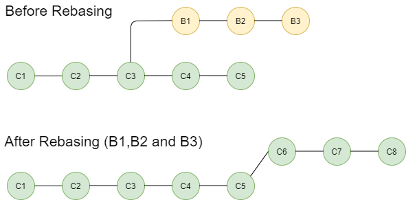
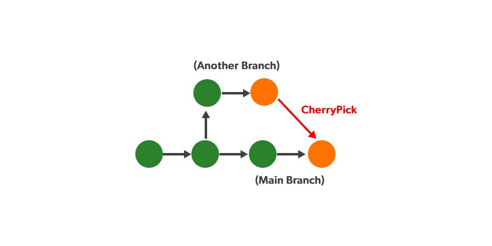

# GIT

## Table of contents
-------------------------

1. [merge conflict](#merge-conflict) 
2. [.gitignore](#.gitignore) 
3. [rebase](#rebase)
4. [cherry picking](#cherry-picking) 
5. [stage](#stage) 
6. [temp branches](#temp-branches) 
7. [when to create branches - feature level](#when-to-create-branches---feature-level)  

### merge conflict
--------------------------

- Version control systems are all about managing contributions between multiple distributed authors ( usually developers ). Sometimes multiple developers may try to edit the same content. If Developer A tries to edit code that Developer B is editing a conflict may occur. To alleviate the occurrence of conflicts developers will work in separate isolated branches. 

- The `git merge` command's primary responsibility is to combine separate branches and resolve any conflicting edits.

- `Merge conflicts` are a common challenge developers face when working with Git. Understanding what they are and how to resolve them effectively is important for smooth collaboration in any project.

**What Are Merge Conflicts?**

- A merge conflict happens when Git is unable to automatically reconcile differences in code between two commits. This typically occurs during a merge operation, where changes from different branches are combined.

- Conflicts generally arise when two people have changed the same lines in a file, or if one developer deleted a file while another developer was modifying it. In these cases, Git cannot automatically determine what is correct. 

- Conflicts only affect the developer conducting the merge, the rest of the team is unaware of the conflict. Git will mark the file as being conflicted and halt the merging process. It is then the developers' responsibility to resolve the conflict.

**Why Do Merge Conflicts Occur?**

Merge conflicts usually arise in the following scenarios:

- **Simultaneous Edits**: Two developers modify the same line of code in different branches.

- **Conflicting Changes**: A file is deleted in one branch and modified in another.

- **Complex Merges**: When multiple branches are being merged, with changes scattered across various files and lines.


**Types of Merge Conflicts**

- While starting the merge

- During the merge

**While starting the merge:** If there are changes in either the working directory or staging area, while merging, then Git will fail to start the merge. This happens because the pending changes could be overridden by the commits that are being merged. This is the error message provided by Git when this type of merge conflict happens :

```python
error: Entry '<fileName>' not uptodate. Cannot merge. (Changes in working directory)
or,
error: Entry '<fileName>' would be overwritten by merge. Cannot merge. (Changes in staging area)

```

This type of conflict can be resolved either by doing git stash save “any_message_to_describe_what_is_saved” (Stashes away any changes in your staging area and working directory in a separate index) OR git checkout <file_name> (throws out your changes), and then the merge can be completed.

**During the merge:** This occurs because you have committed changes that are in conflict with someone else’s committed changes. Git will do its best to merge the files and will leave things for you to resolve manually in the files it lists. This is the error message provided by Git when this type of merge conflict happens :

```python
CONFLICT (content): Merge conflict in <fileName>
Automatic merge failed; fix conflicts and then commit the result. 
```
This type of conflict can be resolved either by manually fixing all the merge conflict for each file OR using git reset ––hard (resets repository in order to back out of merge conflict situation)


**Creating a merge conflict**

In order to get real familiar with merge conflicts, the next section will simulate a conflict to later examine and resolve. The example will be using a Unix-like command-line Git interface to execute the example simulation.

```python
$ mkdir git-merge-test
$ cd git-merge-test
$ git init .
$ echo "this is some content to mess with" > merge.txt
$ git add merge.txt
$ git commit -am"we are commiting the inital content"
[main (root-commit) d48e74c] we are commiting the inital content
1 file changed, 1 insertion(+)
create mode 100644 merge.txt
```

This code example executes a sequence of commands that accomplish the following.

- Create a new directory named `git-merge-test`, change to that directory, and initialize it as a new Git repo.

- Create a new text file `merge.txt` with some content in it.  

- Add `merge.txt` to the repo and commit it.

Now we have a new repo with one branch main and a file `merge.txt` with content in it. Next, we will create a new branch to use as the conflicting merge.


```python
$ git checkout -b new_branch_to_merge_later
$ echo "totally different content to merge later" > merge.txt
$ git commit -am"edited the content of merge.txt to cause a conflict"
[new_branch_to_merge_later 6282319] edited the content of merge.txt to cause a conflict
1 file changed, 1 insertion(+), 1 deletion(-)

```

The proceeding command sequence achieves the following:

- create and check out a new branch named `new_branch_to_merge_later`

- overwrite the content in `merge.txt`  

- commit the new content

With this new branch: `new_branch_to_merge_later` we have created a commit that overrides the content of `merge.txt`

```python

git checkout main
Switched to branch 'main'
echo "content to append" >> merge.txt
git commit -am"appended content to merge.txt"
[main 24fbe3c] appended content to merge.tx
1 file changed, 1 insertion(+)

```

This chain of commands checks out the `main` branch, appends content to `merge.txt`, and commits it. This now puts our example repo in a state where we have 2 new commits. One in the `main` branch and one in the `new_branch_to_merge_later` branch. At this time lets git merge `new_branch_to_merge_later` and see what happen! 

```python
$ git merge new_branch_to_merge_later
Auto-merging merge.txt
CONFLICT (content): Merge conflict in merge.txt
Automatic merge failed; fix conflicts and then commit the result.
```

 A conflict appears. 


**How to identify merge conflicts**

As we have experienced from the proceeding example, Git will produce some descriptive output letting us know that a CONFLICT has occcured. We can gain further insight by running the `git status` command

```python
$ git status
On branch main
You have unmerged paths.
(fix conflicts and run "git commit")
(use "git merge --abort" to abort the merge)

Unmerged paths:
(use "git add <file>..." to mark resolution)

both modified:   merge.txt
```

The output from `git status` indicates that there are unmerged paths due to a conflict. The `merge.text` file now appears in a modified state. Let's examine the file and see whats modified.

```python
$ cat merge.txt
<<<<<<< HEAD
this is some content to mess with
content to append
=======
totally different content to merge later
>>>>>>> new_branch_to_merge_later
```

```python
- <<<<<<< HEAD

- =======

- >>>>>>> new_branch_to_merge_later

```
Here we have used the `cat` command to put out the contents of the merge.txt file. We can see some strange new additions

Think of these new lines as "conflict dividers". The `=======` line is the "center" of the conflict. All the content between the center and the `<<<<<<< HEAD` line is content that exists in the current branch main which the HEAD ref is pointing to. Alternatively all content between the center and `>>>>>>> new_branch_to_merge_later` is content that is present in our merging branch.

**How to resolve merge conflicts using the command line**

The most direct way to resolve a merge conflict is to edit the conflicted file. Open the `merge.txt` file in your favorite editor. For our example lets simply remove all the conflict dividers. The modified `merge.txt` content should then look like:

```python
this is some content to mess with
content to append
totally different content to merge later

```

Once the file has been edited use `git add merge.txt` to stage the new merged content. To finalize the merge create a new commit by executing:

```python
git commit -m "merged and resolved the conflict in merge.txt"
```

Git will see that the conflict has been resolved and creates a new merge commit to finalize the merge.


**Git commands that can help resolve merge conflicts**

- **General tools**

    > git status

   The `status` command is in frequent use when a working with Git and during a merge it will help identify conflicted files.

    > git log --merge

   Passing the `--merge` argument to the git log command will produce a log with a list of commits that conflict between the merging branches.

    > git diff

   `diff` helps find differences between states of a repository/files. This is useful in predicting and preventing merge conflicts.

- **Tools for when git fails to start a merge**

    > git checkout

    `checkout` can be used for undoing changes to files, or for changing branches

    > git reset --mixed

    `reset` can be used to undo changes to the working directory and staging area.

- **Tools for when git conflicts arise during a merge**

    > git merge --abort

    Executing `git merge` with the `--abort` option will exit from the merge process and return the branch to the state before the merge began.

    > git reset

    Git reset can be used during a merge conflict to reset conflicted files to a know good state


[git merge confict](https://www.youtube.com/watch?v=xNVM5UxlFSA)


### .gitignore
--------------------------------------------

When sharing your code with others, there are often files or parts of your project, you do not want to share.

-**Examples**

- log files
- temporary files
- hidden files
- personal files
- etc.

- Git can specify which files or parts of your project should be ignored by Git using a .gitignore file.

- Git will not track files and folders specified in .gitignore. However, the .gitignore file itself IS tracked by Git.

- Ignored files are usually build artifacts and machine generated files that can be derived from your repository source or should otherwise not be committed. Some common examples are:

  - dependency caches, such as the contents of `/node_modules` or `/packages`
  - compiled code, such as `.o`, `.pyc`, and `.class` files
  - build output directories, such as `/bin`, `/out`, or `/target`
  - files generated at runtime, such as `.log`, `.lock`, or `.tmp`
  - hidden system files, such as `.DS_Store` or `Thumbs.db`
  - personal IDE config files, such as `.idea/workspace.xml`

Ignored files are tracked in a special file named `.gitignore` that is checked in at the root of your repository. There is no explicit git ignore command: instead the .gitignore file must be edited and committed by hand when you have new files that you wish to ignore. .gitignore files contain patterns that are matched against file names in your repository to determine whether or not they should be ignored.

**Create .gitignore**

To create a `.gitignore` file, go to the root of your local Git, and create it:

- **Example:**

> touch .gitignore

Now open the file using a text editor.

We are just going to add two simple rules:

- Ignore any files with the `.log` extension

- Ignore everything in any directory named `temp`

  - **Example**

```python
  
# ignore ALL .log files
*.log

# ignore ALL files in ANY directory named temp
temp/
```
Now all `.log` files and anything in `temp` folders will be ignored by Git.


**Local and Personal Git Ignore Rules**

It is also possible to ignore files or folders but not show it in the distributed `.gitignore` file.

These kinds of ignores are specified in the `.git/info/exclude` file. It works the same way as `.gitignore` but are not shown to anyone else.

[.gitignore tutorial](https://www.youtube.com/watch?v=qSnjgEU6VwQ)


### rebase
--------------------------------------

Git rebase can integrate the changes from one branch to another by overcoming the problems that we might have faced while using the git merge command. The changes we will do will be recorded in the form of logs which are useful to go through if any mistakes happen.

**What is Branching?**

Branching means splitting from the master branch so that you can work separately without affecting the main code and other developers. On creating a [Git repository](https://www.geeksforgeeks.org/what-is-a-git-repository/), by default, we are assigned the [master branch](https://www.geeksforgeeks.org/introduction-to-git-branch/). As we start making [commits](https://www.geeksforgeeks.org/what-is-git-commit/), this master branch keeps updating and points to the last commit made to the repository. Branching in Git can show in the image below.


**What is Git Rebase?**

Rebasing in Git is a process of integrating a series of commits on top of another base tip. It takes all the commits of a branch and appends them to the commits of a new branch. Git rebasing looks as follows: 




The technical **syntax** of rebase command is:

```python
git rebase [-i | --interactive] [ options ] [--exec cmd] [--onto newbase | --keep-base] [upstream [branch]]

```

**Uses of Git Rebase**

The main aim of rebasing is to maintain a progressively straight and cleaner project history. Rebasing gives rise to a perfectly linear project history that can follow the end commit of the feature all the way to the beginning of the project without even forking. This makes it easier to navigate your project.

You can integrate the feature branch into the main branch in two ways.

- the first one is by merging directly into a main branch or

- first rebasing and then merging.

The below diagram shows If you rebase the feature branch first it will facilitate a fast-forward merge. Integrating upstream updates into your local repository is frequently done by rebasing. Git merge causes an unnecessary merging to commit each time you want to see how the project has advanced when you pull in upstream modifications.


**Some common use cases for git rebase include:**

- **Keeping a clean and linear commit history:**Git rebasing is mainly used for maintaining a linear history of commits, where commits are interrelated to the co-existing one. it makes it easy to understand code.

- **Updating a feature branch:** By rebasing the feature branch will help us to maintain updates because it is generated from the main branch. The main branch will always be up to date.

- Rebasing the feature branch can bring it up to date with the most recent changes in the main branch if it was generated from a main branch (such as master) and the main branch has since been updated with new commits.

- **Resolving merge conflicts:** Git rebase will help us to resolve [merge conflicts](https://www.geeksforgeeks.org/merge-conflicts-and-how-to-handle-them/). It enables conflicts to be settled at each stage, leading to a cleaner merge, by applying each commit from the branch being rebased separately.


**Git Standard vs Git Interactive Rebase**

Git rebase is in interactive mode when the rebase command accepts an ` — I` argument. This stands for **Interactive**. Without any arguments, the command runs in **Standard mode**. In order to achieve standard rebasing, we follow the following command:

```python
git rebase master branch_x
```
where branch_x is the branch we want to rebase

The above command is equivalent to the following command and will automatically take the commits in your current working branch and apply them to the head of the branch which will be mentioned:

```python
git rebase master
```

Whereas, in Interactive rebasing, you can alter individual commits as they are moved to the new branch. It offers you complete control over the branch’s commit history. In order to achieve interactive rebasing, we follow the following command:

```python
git checkout branch_x

git rebase -i master

```
This command lists all the commits which are about to be moved and asks for rebasing all commits individually and then rebasing them according to the choices you entered. This gives you complete control over what your project history looks like.

**Git Rebase Commands**

The following are the most used Git rebase commands:

- **git rebase master:** The command `git rebase master` can be used to make all modifications found in your master branch part of your current branch.

- **git rebase –continue:** When we are rebasing the branches we will face some conflicts and issues then we need to resolve the issue. After resolving the issue we again continue the rebasing processes for that we use `git rebase –continue`.

- **git rebase –abort:** `Git rebase –abort` command cancels a rebase that is currently underway and restores the branch to its initial state.

- **git rebase –skip:** When rebasing the branches we might face some unresolved conflicts to skip the particular encounters we will use  `git rebase –skip`. Skipping the commit is not good practice it will damage your codebase.

- **git rebase -I HEAD~3:** With the help of this command, you can interactively rebase the most recent three commits onto the active branch. You can choose which commits to rebase, alter commit messages, and squash or divide commits in the interactive editor that is opened.

Make sure you have a backup of the entire code before executing the git rebase; this will allow you to restore the old code in case something goes wrong.

**Configuration Options In Git Rebase**

We can customize the behavior of the rebase according to our requirements. Here are some commonly used configuration options:

- **-I or –interactive:** By using –interactive we can perform rebase interactively where we can edit or commits. By choosing this option, a text editor will open where you can choose which commits to rebase. You can even alter commit messages or combine several commits into a single commit.

- **–onto <newbase>:** Using this option, a new base commit is specified for the rebase procedure. You can use it to rebase several commits onto a different branch or commit.

- **–skip:** If a dispute arises while doing the rebase operation, this option skips a commit. It is employed to instruct Git to forgo a commit and carry out the rebase.

- **–no-verify:** Any pre-commit hooks that have been set up in the repository are disregarded by this option. If you need to fast commit without starting any pre-commit checks, this can be helpful.

- **–auto squash:** The “fixup” or “squash” flags on any commits are immediately applied when this option is selected. When using interactive rebase to clear up a commit history, this can be helpful.

Git rebases configuration options should be used carefully because they can significantly affect the repository’s commit history. Prior to sending changes to the repository, make sure to evaluate and thoroughly test all rebase-related modifications.


**Git Rebase vs Merge**

Both merge and rebase are used to merge branches but the difference lies in the commit history after you integrate one branch into another. In Git merging, commits from all the developers who made commits will be there in the git log. This is really good for beginners cause the head can be rolled back to commit from any of the developers. Whereas, in git rebases, a commit from only a single developer will be stamped in the git log. Advanced developers prefer this cause it makes the commit history linear and clean. The command for merging is given as:

```python
git merge branch_x master
```

This creates a new commit in the merged branch that ties together the histories of both branches, giving you a branch structure that looks like this as opposed to rebasing what we saw above: 


**Note:** After performing rebasing, we are by default on the last commit of the rebased branch.

**Git Rebase Abort**

Once you did the rebase of the branch and you want to undo the changes and revert back to the previous changes it is possible by using the `git reset` command. It will undo the git raise command and roll back to the Periovus version 

```python
git reset --hard <branch-name>
```

`– hard` is like a hard option and we use “branch name”. By doing the above two steps you can undo the changes.


**Steps to Recover Lost Changes Process of Upstream Rebase**

By following the below steps you can recover the changes you lost in the process of  Upstream Rebase.

- **Step 1:** First, go through the local repository for missing commits reflog. The reflog keeps track of all repository modifications, such as branch updates, merges, and rebase. Run the git reflog command to see the reflog. Find the commit IDs for the lost changes you made and copy the most recent one.

- **Step 2:** Create a new branch by using the commit Id you recovered which is lost by using the below command.

```python
git branch <new branch name> <commit id>
```


- **Step 3:** After creating the new branch by using cherry-pick command you can recover the changes that were lost in the upstream rebase. For this use the below command.

```python
cherry pick <commit id> 
```


- **Step 4:** While using the cherry-pick command you may face lots of conflicts and problems that need to be resolved. After resolving the conflicts use the below command and stage the files.

```python
git add <file> 
```

- **Step 5:** The last and final step after completion of all the above steps by resolving all the errors, know to push the branch that has been created newly to the remote repository by using the below command.

```python
 git push -u origin <new branch name>.
```

After completion of all the above steps, we can check our remote repository like (GitHub) whether the new branch is pushed with all the lost changes or not.


**Git Pull Rebase**

The `git pull –rebase` command helps us to perform fetching and rebasing on top of those changes. Git pull will fetch the files from the remote repository and merges them with the branch we want to merge.

But, when you use the git pull —rebase command, Git pulls updates from the remote repository and rebases your current branch on top of them, thereby applying your local commits on top of the fresh remote updates. As a result, the commit history becomes linear and is simpler to read and comprehend.

**How to Git Pull Rebase in the Command Line?**

- **Step 1:** Use the below command to fetch the remote repository.

```python
git fetch <remote>
```

- **Step 2:** Know to apply the following command to rebase your local branch on top of new changes. 

```python
git pull --rebase
```

if any conflicts are encountered the processes will be paused and you have to resolve the conflicts after that you can use the below command to continue the process.

```python
 git rebase --continue
```


[git merge vs git rebase ](https://www.youtube.com/watch?v=0chZFIZLR_0)


### cherry picking
------------------------------------

**Git cherry pick**

- `git cherry-pick` is a powerful command that enables arbitrary Git commits to be picked by reference and appended to the current working HEAD.

- Cherry picking is the act of picking a commit from a branch and applying it to another.

- `git cherry-pick` can be useful for undoing changes. For example, say a commit is accidently made to the wrong branch. You can switch to the correct branch and cherry-pick the commit to where it should belong.



**When to use git cherry pick**

`git cherry-pick` is a useful tool but not always a best practice. Cherry picking can cause duplicate commits and many scenarios where cherry picking would work, traditional merges are preferred instead. With that said git cherry-pick is a handy tool for a few scenarios...

**Team collaboration**

Often times a team will find individual members working in or around the same code. Maybe a new product feature has a backend and frontend component. There may be some shared code between to two product sectors. Maybe the backend developer creates a data structure that the frontend will also need to utilize. The frontend developer could use `git cherry-pick` to pick the commit in which this hypothetical data structure was created. This pick would enable the frontend developer to continue progress on their side of the project.

**Bug hotfixes**

When a bug is discovered it is important to deliver a fix to end users as quickly as possible. For an example scenario,say a developer has started work on a new feature. During that new feature development they identify a pre-existing bug. The developer creates an explicit commit patching this bug. This new patch commit can be cherry-picked directly to the main branch to fix the bug before it effects more users.

**Undoing changes and restoring lost commits**

Sometimes a `feature` branch may go stale and not get merged into `main`. Sometimes a pull request might get closed without merging. Git never loses those commits and through commands like [git log](https://www.atlassian.com/git/tutorials/git-log) and [git reflog](https://www.atlassian.com/git/tutorials/rewriting-history/git-reflog) they can be found and cherry picked back to life.

**How to use git cherry pick**

To demonstrate how to use `git cherry-pick` let us assume we have a repository with the following branch state:

```python
   a - b - c - d   Main
         \
           e - f - g Feature
```

`git cherry-pick` usage is straight forward and can be executed like:

```python
git cherry-pick commitSha
```

In this example `commit`Sha is a commit reference. You can find a commit reference by using `git log`. In this example we have constructed lets say we wanted to use commit `f` in `main`. First we ensure that we are working on the `main` branch.

```python
git checkout main
```

Then we execute the cherry-pick with the following command:

```python
git cherry-pick f
```

Once executed our Git history will look like:

```python
    a - b - c - d - f   Main
         \
           e - f - g Feature
```

The f commit has been successfully picked into the main branch

**Examples of git cherry pick**

 git cherry pick can also be passed some execution options.

```python
-edit
```
Passing the `-edit` option will cause git to prompt for a commit message before applying the cherry-pick operation

```python
--no-commit
```

The `--no-commit` option will execute the cherry pick but instead of making a new commit it will move the contents of the target commit into the working directory of the current branch.

```python
--signoff
```

The `--signoff` option will add a 'signoff' signature line to the end of the cherry-pick commit message

In addition to these helpful options `git cherry-pick` also accepts a variety of merge strategy options. Learn more about these options at the git merge strategies documentation.

Additionally, git cherry-pick also accepts option input for merge conflict resolution, this includes options: `--abort` `--continue` and `--quit` .

Cherry picking is a powerful and convenient command that is incredibly useful in a few scenarios. Cherry picking should not be misused in place of git merge or git rebase. The git log command is required to help find commits to cherry pick.


[Git CHERRY PICK ](https://www.youtube.com/watch?v=i657Bg_HAWI)

[Git Cherry Pick Merge Conflicts](https://www.youtube.com/watch?v=aUeNbpSkY8k)


### Stage
--------------------------------

**What is Staging in Git?**

In Git, staging refers to the process of preparing changes (like new files, modifications, or deletions) to be included in the next commit. The staging area (also known as the index) is a space where you can gather these changes before actually committing them to your Git repository.

Think of the staging area as a preview of what will go into the next commit. It allows you to review and control what specific changes are included in that commit, which is especially useful when working on multiple changes and you only want to commit some of them.

**How Staging Works**

- **Working Directory:** This is where you make changes to your files. These changes are not yet tracked by Git until you add them to the staging area.

- **Staging Area (Index):** After making changes, you use the git add command to add these changes to the staging area. Only the changes that are in the staging area will be included in the next commit.

- **Commit:** Once you're satisfied with the changes in the staging area, you use the git commit command to save those changes permanently in your Git repository.


**Why Staging is Important**

- **Selective Commit:** You can choose which changes to include in the next commit, allowing you to break down larger changes into smaller, more manageable commits.

- **Organized Commits:** It helps in creating logically grouped commits, which makes your project history cleaner and easier to understand.

- **Review Changes:** The staging area allows you to review and modify what will be committed, reducing the chance of accidentally committing incomplete or unnecessary changes.

**Staging Methods**

Various methods for adding changes to the staging area:

1. **Stage All Changes in the Current Directory:**

If you want to stage all changes in your working directory, you can use:

```python
git add .
```
This command stages all modified, deleted, and new files in the current directory and its subdirectories.

2. **Stage All Changes in the Repository:**

If you want to stage all changes in the entire repository, you can use:

```python
git add -A
```
This command stages all changes (including modifications, deletions, and new files) in the entire repository, regardless of the directory you are in.

3. **Stage a Specific File:**

If you only want to stage changes in a specific file, you can use:

```python
git add a.txt
```
This will only stage changes made to `a.txt`.

**Example**

```python
# Initialize a new Git repository
git init

# Create a new file and add some content
echo "Initial content for the README file." > README.md

# Create another file
echo "print('Hello, World!')" > hello.py

# Check the current status of your repository
git status
# Output:
# Untracked files:
#   (use "git add <file>..." to include in what will be committed)
#         README.md
#         hello.py

# Stage the README.md file
git add README.md     ------->"added to staging area"

# Check the status to see the staged and unstaged files
git status
# Output:
# Changes to be committed:
#   (use "git restore --staged <file>..." to unstage)
#         new file:   README.md
#
# Untracked files:
#   (use "git add <file>..." to include in what will be committed)
#         hello.py

# Modify the hello.py file
echo "print('Goodbye, World!')" >> hello.py

# Check the status again to see modified files
git status
# Output:
# Changes to be committed:
#   (use "git restore --staged <file>..." to unstage)
#         new file:   README.md
#
# Changes not staged for commit:
#   (use "git add <file>..." to update what will be committed)
#   (use "git restore <file>..." to discard changes in working directory)
#         modified:   hello.py

# Stage all changes, including the modification to hello.py
git add .    ------->"added to staging area"

# Check the status to confirm all changes are staged
git status
# Output:
# Changes to be committed:
#         new file:   README.md
#         modified:   hello.py

# Commit the staged changes
git commit -m "Added README.md and updated hello.py with a new message"
```

[**Staging files**](https://www.youtube.com/watch?v=KngvG8WzYLU)


### temp branches
----------------------------------------------------

Temporary branches in Git are branches created for short-term use, typically for developing new features, fixing bugs, or experimenting without affecting the main codebase. Once the work on a temporary branch is complete, the branch can be merged into the main branch (e.g., `main` or `master`) or deleted if it's no longer needed.

**Common Use Cases for Temporary Branches:**

1. **Feature Development**: When developing a new feature, you might create a branch named `feature/new-feature` to isolate your work from the main branch.
   
   ```bash
   git checkout -b feature/new-feature
   ```
   
2. **Bug Fixing**: For fixing a bug, you might create a branch named `fix/bug-id` to track the changes specific to that bug.
   
   ```bash
   git checkout -b fix/bug-id
   ```
   
3. **Experimentation**: If you want to try something out without committing to it in the main branch, you can create a temporary branch like `experiment/try-new-approach`.
   
   ```bash
   git checkout -b experiment/try-new-approach
   ```

**Managing Temporary Branches:**

- **Merging**: Once your work is complete and tested, you can merge it back into the main branch.

  ```bash
  git checkout main
  git merge feature/new-feature
  ```
  
- **Deleting**: After merging or if the branch is no longer needed, you can delete the temporary branch.

  ```bash
  git branch -d feature/new-feature
  ```

- **Force Deleting**: If the branch has unmerged changes and you still want to delete it, you can force delete it.

  ```bash
  git branch -D feature/new-feature
  ```

### when to create branches - feature level
-----------------------------------------------

**Git feature branch workflow**

The core idea behind the Feature Branch Workflow is that all feature development should take place in a dedicated branch instead of the main branch. This encapsulation makes it easy for multiple developers to work on a particular feature without disturbing the main codebase. It also means the main branch will never contain broken code, which is a huge advantage for continuous integration environments.

Encapsulating feature development also makes it possible to leverage pull requests, which are a way to initiate discussions around a branch. They give other developers the opportunity to sign off on a feature before it gets integrated into the official project. Or, if you get stuck in the middle of a feature, you can open a pull request asking for suggestions from your colleagues. The point is, pull requests make it incredibly easy for your team to comment on each other’s work.


**How it works**

The Feature Branch Workflow assumes a central repository, and `main` represents the official project history. Instead of committing directly on their local `main` branch, developers create a new branch every time they start work on a new feature. Feature branches should have descriptive names, like animated-menu-items or issue-#1061. The idea is to give a clear, highly-focused purpose to each branch. Git makes no technical distinction between the `main` branch and feature branches, so developers can edit, stage, and commit changes to a feature branch.
 

In addition, feature branches can (and should) be pushed to the central repository. This makes it possible to share a feature with other developers without touching any official code. Since `main` is the only “special” branch, storing several feature branches on the central repository doesn’t pose any problems. Of course, this is also a convenient way to back up everybody’s local commits. The following is a walk-through of the life-cycle of a feature branch.

**Start with the main branch**

All feature branches are created off the latest code state of a project. This guide assumes this is maintained and updated in the `main` branch.

```python
git checkout main
git fetch origin 
git reset --hard origin/main
```

This switches the repo to the `main` branch, pulls the latest commits and resets the repo's local copy of `main` to match the latest version.

**Create a new-branch**

Use a separate branch for each feature or issue you work on. After creating a branch, check it out locally so that any changes you make will be on that branch.

```python
git checkout -b new-feature
```

This checks out a branch called new-feature based on main, and the `-b` flag tells Git to create the branch if it doesn’t already exist.

**Update, add, commit, and push changes**

On this branch, edit, stage, and commit changes in the usual fashion, building up the feature with as many commits as necessary. Work on the feature and make commits like you would any time you use Git. When ready, push your commits, updating the feature branch.

```python
git status
git add <some-file>
git commit
```

**Push feature branch to remote**

It’s a good idea to push the feature branch up to the central repository. This serves as a convenient backup, when collaborating with other developers, this would give them access to view commits to the new branch.

```python
git push -u origin new-feature
```

This command pushes new-feature to the central repository (origin), and the `-u` flag adds it as a remote tracking branch. After setting up the tracking branch, `git push` can be invoked without any parameters to automatically push the new-feature branch to the central repository. 


**Resolve feedback**

Now teammates comment and approve the pushed commits. Resolve their comments locally, commit, and push the suggested changes to Bitbucket. Your updates appear in the pull request.

**Merge your pull request**

Before you merge, you may have to resolve merge conflicts if others have made changes to the repo. When your pull request is approved and conflict-free, you can add your code to the main branch. Merge from the pull request in Bitbucket.


**Pull requests**

Aside from isolating feature development, branches make it possible to discuss changes via pull requests. Once someone completes a feature, they don’t immediately merge it into `main`. Instead, they push the feature branch to the central server and file a pull request asking to merge their additions into `main`. This gives other developers an opportunity to review the changes before they become a part of the main codebase.

Code review is a major benefit of pull requests, but they’re actually designed to be a generic way to talk about code. You can think of pull requests as a discussion dedicated to a particular branch. This means that they can also be used much earlier in the development process. For example, if a developer needs help with a particular feature, all they have to do is file a pull request. Interested parties will be notified automatically, and they’ll be able to see the question right next to the relevant commits.

Once a pull request is accepted, the actual act of publishing a feature is much the same as in the Centralized Workflow. First, you need to make sure your local `main` is synchronized with the upstream `main`. Then, you merge the feature branch into `main` and push the updated `main` back to the central repository.

Pull requests can be facilitated by source code management solutions like Bitbucket Cloud.